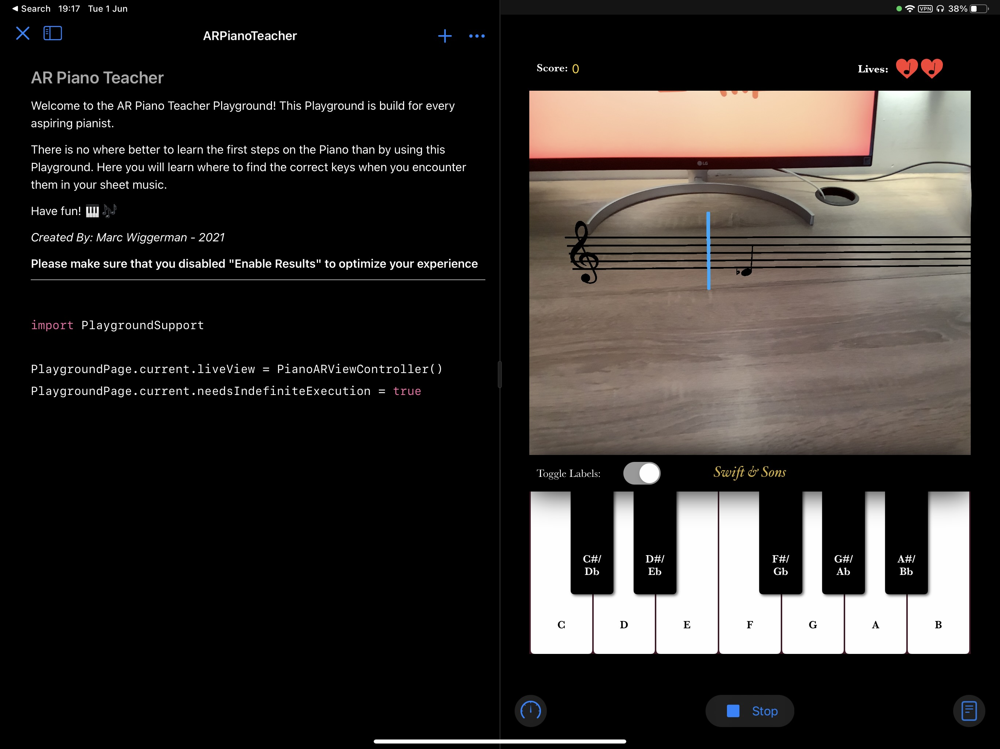

# AR Piano Teacher - Swift Playground

This playground contains a game in AR that can help you to learn to read the notes on a staff. After the AR items are placed, notes flow over the staff. By the time they reach the end of the staff you need to play the note on the in-app keyboard.

### How to run this Playground
To run this Playground, open it on an AR-capable device using Swift Playgrounds (3.4.1). Make sure to run it with "Enable Results" turned off (this option can be found in the menu opened using the button next to "Run My Code").

--- 

**Status of the submission**: Accepted 🎉